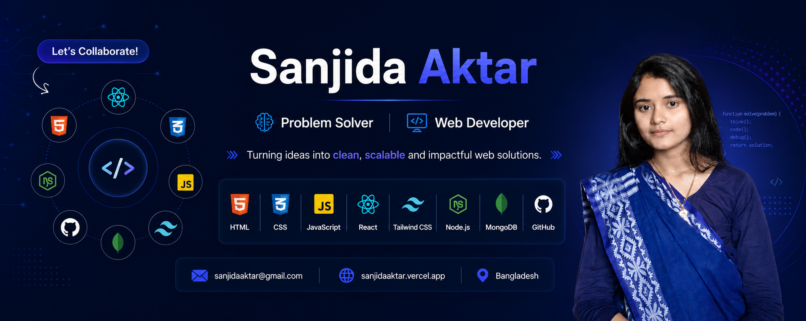

<p align="center">
  
</p>

<h1 align="center">Hi 👋, I'm Sanjida Aktar</h1>

<h3 align="center">
Web Developer | CSE Student | Future Software Engineer from Bangladesh 🇧🇩
</h3>

<p align="center">
  
</p>

---

## 👩‍💻 About Me

I am a passionate Computer Science & Engineering student at Exim Bank Agricultural University Bangladesh. I enjoy building modern, responsive, and user-friendly web applications.


- 💻 Focused on **Frontend & Full Stack Web Development**
- 📚 Learning **DSA, DBMS, and Operating Systems**
- 🎯 Goal: Become a skilled Software Engineer
- ⚡ Fun Fact: I love turning ideas into real-world applications!

---

## 🚀 Current Activities

- Building portfolio-worthy web projects
- Solving DSA problems on LeetCode
- Learning Next.js App Router
- Improving UI/UX and animations
- Exploring backend technologies

---

## 🛠️ Tech Stack

<div align="center">

### Languages


### Frontend


### Backend & Database


### Tools


</div>

---

## 🌐 Connect With Me

<p align="center">
<a href="https://github.com/Sanjida-Aktar">

</a>

<a href="https://www.linkedin.com/in/swe-sanjida-aktar/">

</a>

<a href="mst.sanjida.aktar.cnj.bd@gmail.com">

</a>
</p>

---

## 📊 GitHub Stats

<p align="center">


</p>

<p align="center">

</p>

---
## 📚 Currently Learning

```txt
✔ React
✔ Next.js
✔ TypeScript
✔ DSA
✔ DBMS
✔ Operating Systems
✔ System Design
```

---

## ✨ Quote

> "The best way to predict the future is to code it."

---

<p align="center">


### Thanks for visiting my profile! ❤️

</p>
